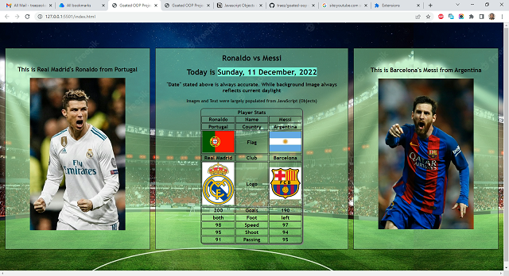

# Section.io - Goated OOP Project With Javascript Solution

This is a solution to the [Goated OOP Project With Javascript as seen on YouTube](https://www.youtube.com/watch?v=jDzVgSQUzEE). I am trying to improve my coding skills by building realistic projects. 

## Table of contents

- [Overview](#overview)
  - [The challenge](#the-challenge)
  - [Screenshot](#screenshot)
  - [Links](#links)
- [My process](#my-process)
  - [Built with](#built-with)
  - [What I learned](#what-i-learned)
  - [Continued development](#continued-development)
  - [Useful resources](#useful-resources)
- [Author](#author)
- [Acknowledgments](#acknowledgments)

## Overview

### The challenge

Users should be able to:

- See Date, Time and Background Image display responsively. That is, date is always current, and background image reflects day or nice depending on time of day.  
- Text and Images to should be largely populated from Javascript Objects.  

### Screenshot

### Links

- Solution URL: [https://github.com/traez/local-storage-oop-beginner-project](https://github.com/traez/local-storage-oop-beginner-project)
- Live Site URL: [https://traez.github.io/local-storage-oop-beginner-project/](https://traez.github.io/local-storage-oop-beginner-project/)

## My process

### Built with

- Semantic HTML5 markup
- CSS custom properties
- Flexbox
- CSS Grid
- Mobile-first workflow

### What I learned

1) Additional acquaintance using Objects. 
2) Populating text and images from Javascript (and not HTML or CSS)

### Continued development

Will increasingly take on increasingly complex OOP projects.    

### Useful resources

Stackoverflow, MDN Web Docs, w3schools, YouTube, Google 

## Author

- Website - [Trae Zeeofor](https://github.com/traez)  
- Twitter - [@trae_z](https://twitter.com/trae_z) 

## Acknowledgments

Congrats to all WorldCup Semi-Finalists.
